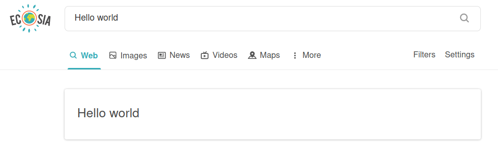

## ecosia-plugin-react
**An easy to use plugin that makes planting trees even easier**

### About
This is boilerplate code for making a search extension for Ecosia, most of which is forked from [kryptokinght's react-extension-boilerplate](https://github.com/kryptokinght/react-extension-boilerplate). It allows developers to easily create cool features like DuckDuckGo's [password generation feature](https://duckduckgo.com/?q=password+strong+12&ia=answer) _[(more info)](https://help.duckduckgo.com/duckduckgo-help-pages/features/instant-answers-and-other-features/)_ or Google(🤢)'s [timer feature](https://www.google.com/search?q=timer) with React.
My example plugin just echos "Hello world" if you search it in Ecosia... but the possibilities are truly endless! The idea is that cool new features will help reel in new users to Ecosia, and new Ecosia users === more trees planted 🌳💞. 


### Installation
```
# clone the repo
$ git clone git@github.com:nbennett320/ecosia-plugin-react.git

# not sure what does but it seems to work
$ cd ecosia-plugin-react/

# install dependencies with yarn
$ yarn install
```

### Usage
```
# open a development window in firefox 
$ yarn run start:firefox

# open a development window in (🤢) chrome 
$ yarn run start:chrome

# build files to './extension'
$ yarn run build

# compress build folder to {manifest.name}.zip and crx
$ npm run build
$ npm run compress -- [options]
```

More info and details can be found on [kryptokinght's repo](https://github.com/kryptokinght/react-extension-boilerplate).